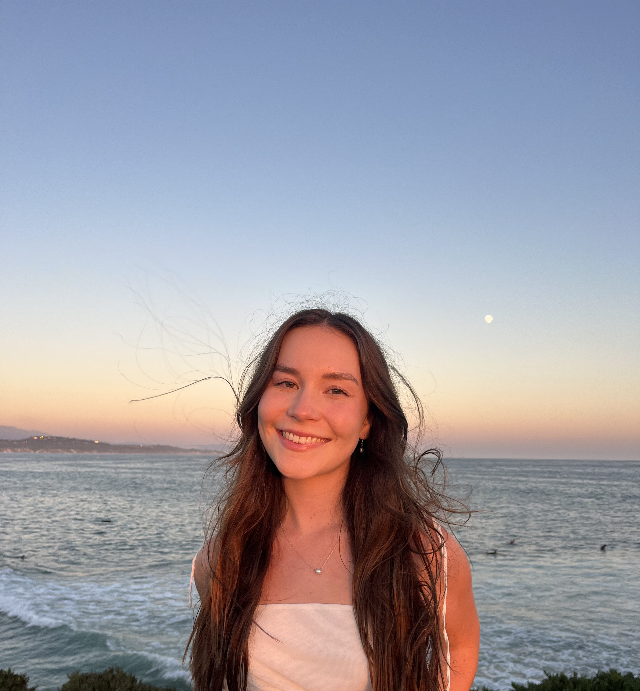
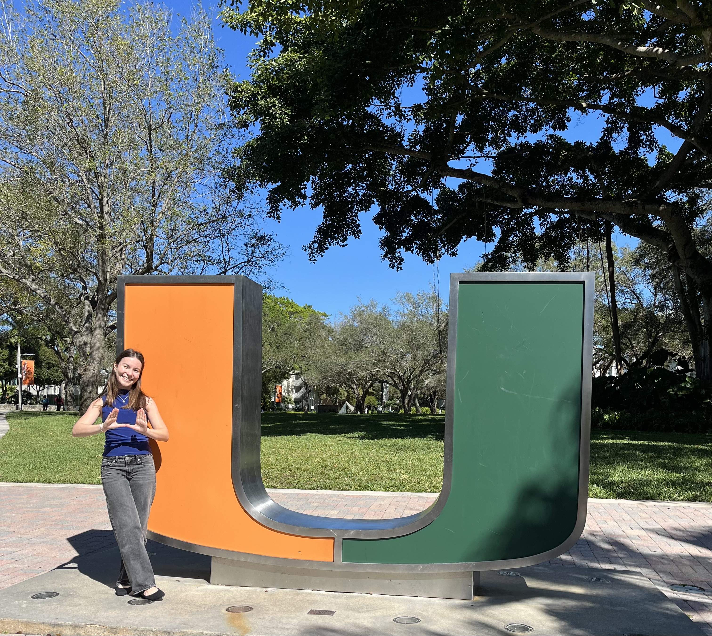
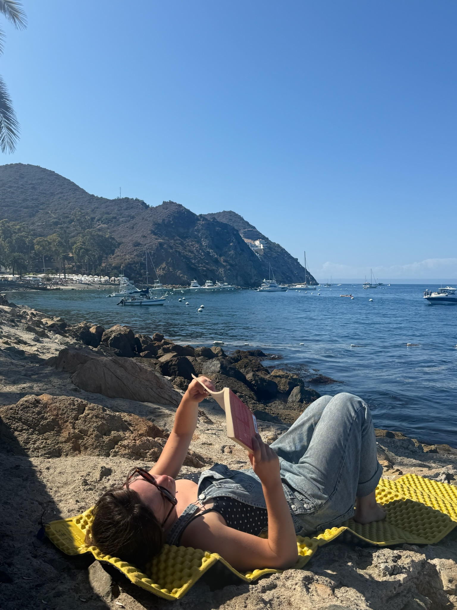

---- 

# Currently 
:::: {layout="[70,30]"}
::: {#text}
I'm a fourth-year Environmental Studies B.S. student at UC Santa Barbara, where my research has spanned endangered species conservation, marine debris, geospatial data science, science communication, and environmental education. Outside the classroom, I lead the [Spotting Giant Sea Bass Project](https://spottinggiantseabass.msi.ucsb.edu/) at the [Benioff Ocean Science Laboratory](https://bosl.ucsb.edu/) and direct [UCSB Sprout Up](https://www.sproutup.org/), a nonprofit bringing environmental education to elementary schools. Head to my Projects page to see more of what I've been up to!
:::
::: {#image}

:::
::::

----

# Upcoming
:::: {layout="[70,30]"}
::: {#text}
This coming fall, I'll be joining the [University of Miami's Rosenstiel School](https://www.earth.miami.edu/) to pursue my [PhD in Environmental Science and Policy](https://abess.miami.edu/academics/ph.d.-program/index.html) in Dr. Juan Carlos Villaseñor-Derbez's [Human-Ocean Systems Lab](https://human-ocean-systems.org/). My research will use data science, spatial analysis, and causal inference to understand how marine policy and environmental change shape human behavior at sea. I'm excited to grow as a researcher and explore the city of Miami!
:::
::: {#image}

:::
::::

----

# Interests
:::: {layout="[70,30]"}
::: {#text}
When I'm not in the field or behind a screen, you can find me backpacking, scuba diving, practicing yoga, or listening to live music. I inherited a love for running from my mom, and I completed my first half-marathon in 2024. I'm also an avid reader - check out my [GoodReads](https://www.goodreads.com/user/show/160574617-macey-hartmann) to see what I'm reading right now! 
:::
::: {#image}

:::
::::

