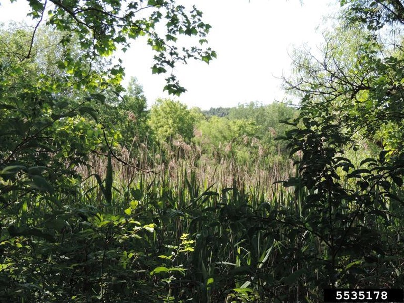

In the Winter and Spring quarters of 2025, I worked as a Sustainability Intern for NASA Headquarters investigating the feasibility of using remote sensing and GIS to understand Invasive and Non-Native Plant Species (INPS) across NASA centers. Invasive species already cost the United States more than $21 billion annually in economic and health-related impacts, and many NASA centers had identified INPS as one of their most pressing environmental management challenges; however, there was a lack of a standardized monitoring approach.

<figure style="float: right; width: 250px; margin: 0 0 15px 20px;">
  
  <figcaption style="font-size: 0.85em; text-align: center;">Common reed (*Phragmites australis*) Richard Gardner, Bugwood.org</figcaption>
</figure>

To fill that gap, I conducted a comprehensive feasibility study, reviewing Natural Resource Management Plans, environmental resource documents, and existing scientific literature, while also interviewing natural resource staff at nine NASA centers across the country. I developed a weighted scoring system that evaluated each center across four categories — invasive species risk, land cover suitability, available imagery, and existing resources — to determine where remote sensing and GIS tools could be most effectively implemented.

The findings identified Wallops Flight Facility, Glenn Research Center, Kennedy Space Center, and Marshall Space Flight Center as the strongest candidates for implementation, each facing high INPS risk with the landscape characteristics and imagery resources to support a remote sensing approach. The study also highlighted Johnson Space Center as a potential model for network-wide adoption, given its existing GIS and remote sensing infrastructure. The final report offers NASA a practical roadmap for moving from fragmented, ground-based surveys toward a scalable, data-driven system for early detection and long-term monitoring of invasive species across its facilities.

