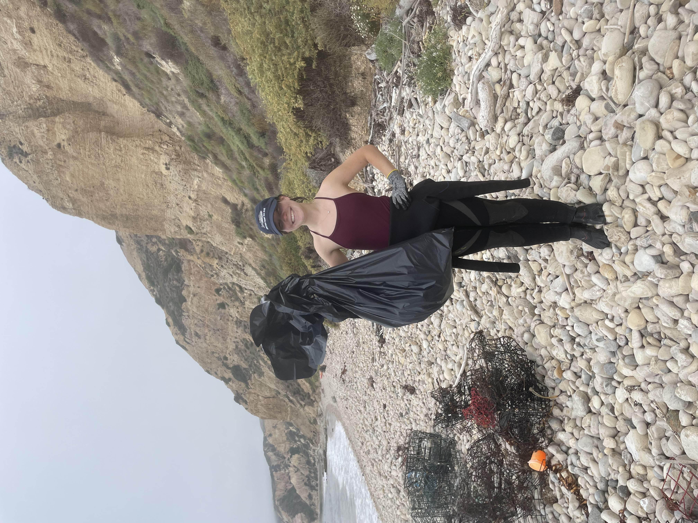
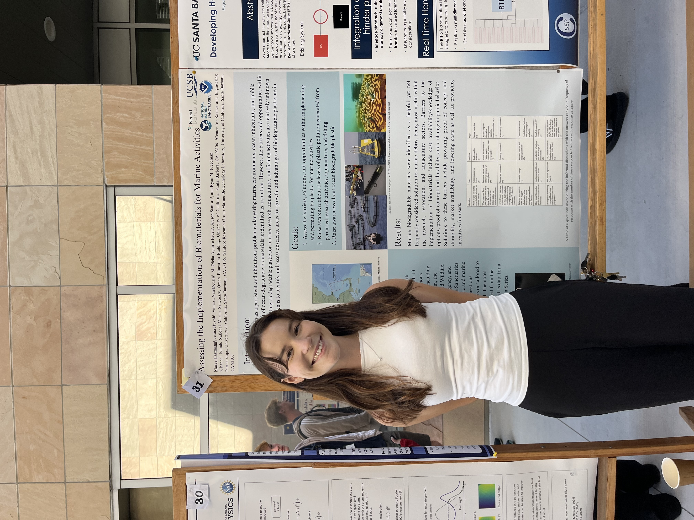

::: {.lightbox layout="[[1, 1]]"}

From January to September of 2024, I worked as a Marine Debris, Federal Policy, and Regulatory Intern for [Nereid Biomaterials](https://nereidbio.com/) and [NOAA Channel Islands National Marine Sanctuary](https://channelislands.noaa.gov/). Plastic waste is a persistent and growing threat to marine environments, ocean inhabitants, and public health, and while ocean-degradable biomaterials have emerged as a promising solution, almost nothing was known about the real-world barriers to implementing them within permitted marine activities.

To change that, I conducted 11 hour-long informal discussions with 13 permit coordinators and staff across major environmental agencies, including the NOAA Marine Debris Program, the California Department of Fish and Wildlife, the EPA, and several NOAA National Marine Sanctuaries. Through these conversations, I assessed the obstacles, opportunities, and policy landscape surrounding the use of biodegradable plastics in marine research, aquaculture, and fishing.

The findings revealed that while marine biodegradable materials were widely seen as a valuable tool — particularly in research, restoration, and aquaculture — they were rarely being considered in practice. The biggest barriers came down to cost, limited awareness of available options, and a lack of proof of concept and durability. The research was compiled into a published NOAA Conservation Series report. I also had the opportunity to take the work beyond the page, assisting with field testing of biomaterials in the Northern Channel Islands, putting the science directly into the water.

::: {.lightbox layout="[[1, 1]]"}

 (4).pdf)

