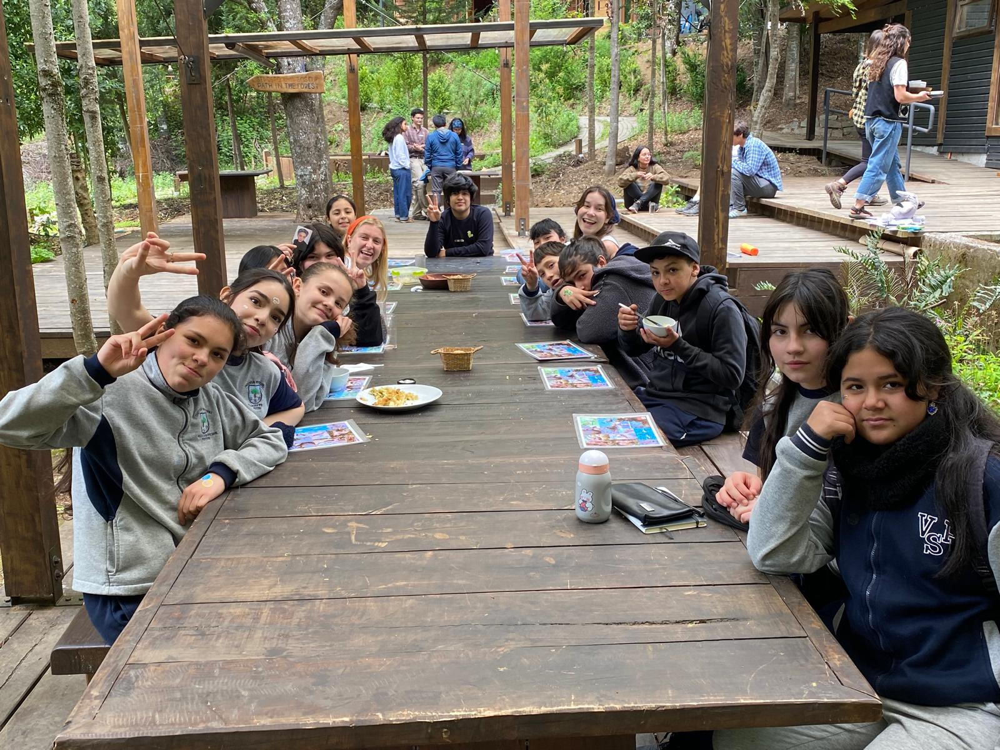
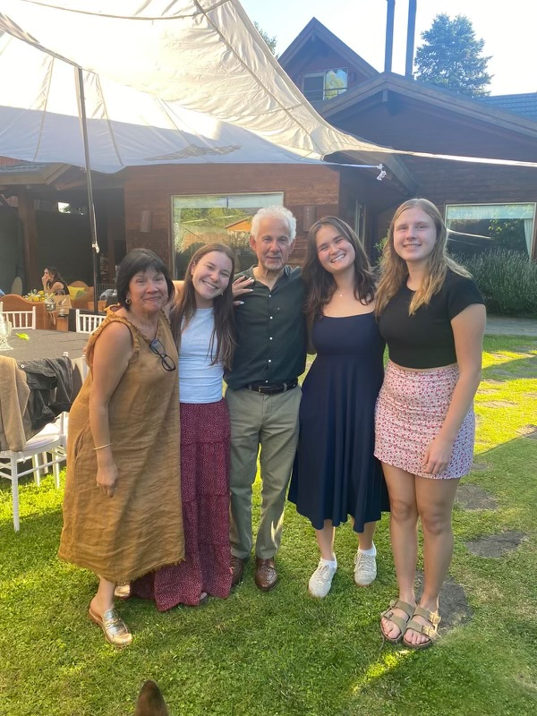
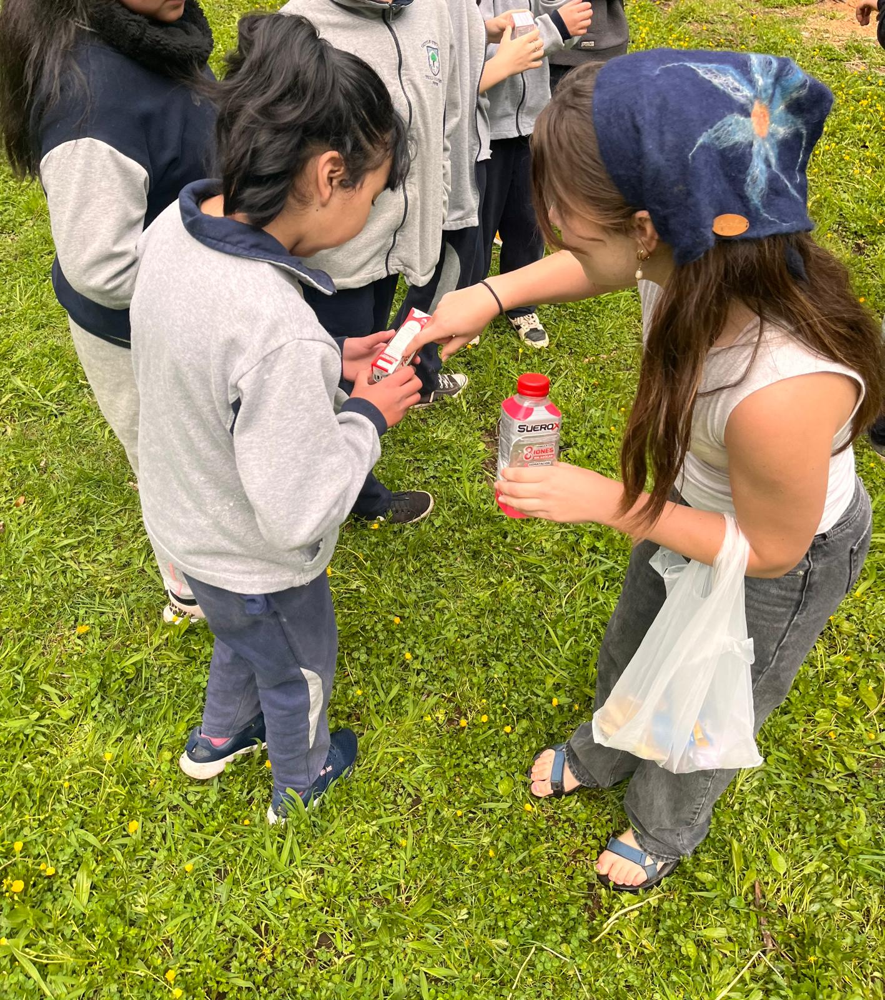
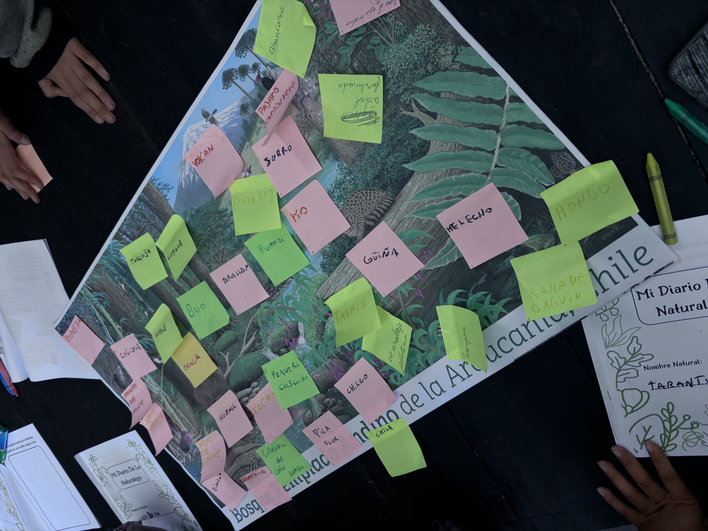

::: {style="text-align: center"}
{width=60%}
:::

In the Fall of 2024, I studied abroad with [UCEAP's Social Ecological Sustainability Program](https://uceap.universityofcalifornia.edu/programs/social-ecological-sustainability), living with a host family in Villarrica, Chile. This experience deepened my Spanish, immersed me in Chilean culture, and pushed my research in directions I hadn't expected.

<figure style="float: right; width: 250px; margin: 0 0 15px 20px;">
  
  <figcaption style="font-size: 0.85em; text-align: center;">My Villarrica host family</figcaption>
</figure>

Alongside a team of fellow UC researchers, I conducted a mixed-methods study exploring how primary schools in Chile's Araucanía region integrate intercultural and environmental education into their curriculum, and how those values carry into students' everyday lives. The Araucanía region is home to a significant Mapuche population, and Chilean law requires schools where more than 20% of students identify as Indigenous to incorporate traditional cultural knowledge into the classroom. These factors made the region a fascinating place to study the intersection of ecological and intercultural education.

We spent a day with thirteen sixth-grade students from Villa San Pedro Primary School, leading three hands-on activities: a nature drawing exercise where students illustrated their favorite memories in nature, a recycling basketball game that tested their knowledge of waste management, and a biodiversity identification game using posters of the local Andean temperate forest and traditional Mapuche family gardens. We also conducted five in-depth interviews with students, teachers, parents, and municipal administrators to understand how these values were taught, practiced, and passed down across generations.

::: {.lightbox layout="[[1, 1, 1]]"}

::: 

The research revealed that while students demonstrated a solid foundation in environmental knowledge (correctly sorting recyclables, identifying sacred Mapuche species like the Araucaria), there remained meaningful gaps between classroom learning and everyday practice. Perhaps most memorably, it showed that children's connections to nature were often shaped more by family traditions and cultural memory than by formal education alone. Check out our final report below!

{width="95%" height="625"}

