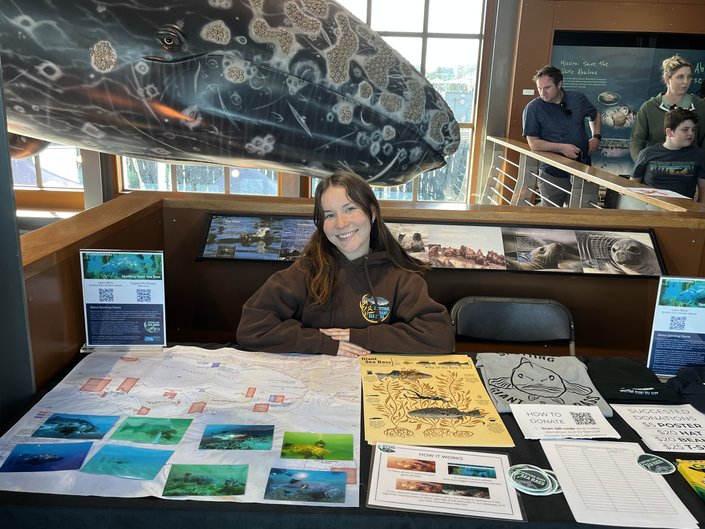
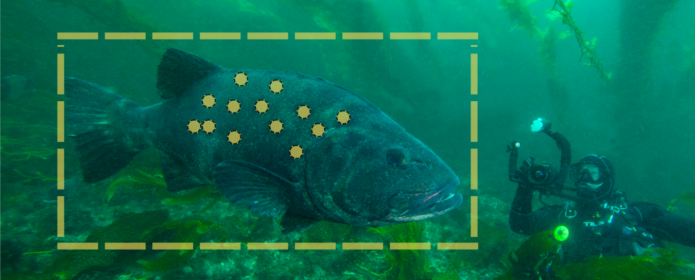
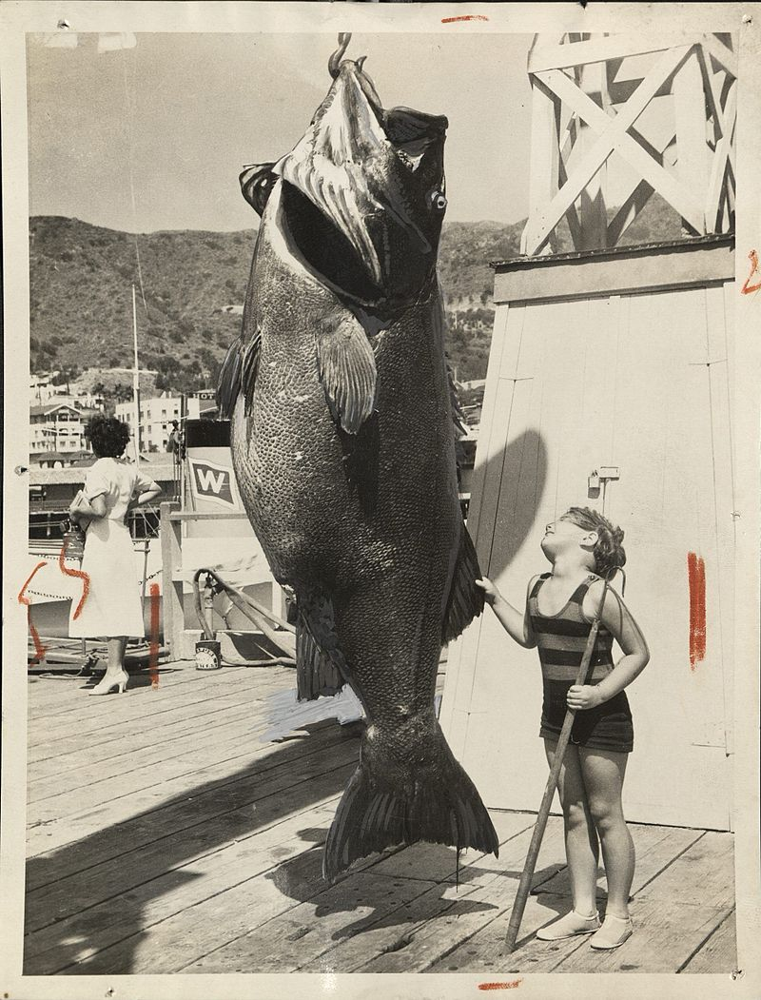

## My Role 

I joined the Benioff Ocean Science Laboratory's Spotting Giant Sea Bass Project as a Schmidt Environmental Solutions Fellow, and I haven't been able to stop thinking about the giant fish ever since! After becoming project lead in January 2025, I now contribute to everything from data analysis and spot mapping to community outreach and social media. My senior thesis is bringing all of my work on this project full circle.

## How It Works 

The Spotting Giant Sea Bass Project is a collaborative community science effort that taps into the knowledge and curiosity of the fishing and diving community. By collecting photos and videos submitted by everyday ocean-goers, we use advanced computer algorithms to match the unique spot patterns of individual giant sea bass. Spotting Giant Sea Bass is similar to a fingerprint database, but for a critically endangered fish that can grow to 800 pounds and live for 75 years. These matches help scientists piece together population numbers, movement patterns, and the use of marine protected areas.

## About Giant Sea Bass

<figure style="float: right; width: 250px; margin: 0 0 15px 20px;">
  
  <figcaption style="font-size: 0.85em; text-align: center;">Photo credit: Bud Gardner Photograph Collection, University of South Florida</figcaption>
</figure>

Nicknamed the "King of the Kelp Forest," giant sea bass (*Stereolepis gigas*) are the largest resident bony fish in California and apex predators of the kelp forest ecosystem. Despite being protected by a California fishing moratorium and classified as Critically Endangered by the IUCN, their population has remained poorly understood — until now. A recent [direct population assessment](https://www.int-res.com/abstracts/meps/v760/meps14843) estimates that just over 1,220 adult giant sea bass called Southern California home between 2015 and 2022, offering the first concrete look at their numbers. While evidence suggests the population is slowly increasing, researchers caution that there is still a long way to go before recovery can be celebrated.

## The Spotting Giant Sea Bass Project

The Spotting Giant Sea Bass Project was created in 2017 to fill these gaps using community-sourced photos from recreational divers and fishers. To date, our database includes over 1,800 verified encounters contributed by 500+ community scientists, from which we have identified 805 left-side and 780 right-side individuals using highly accurate pattern recognition software. This growing repository supports population estimates critical to evaluating recovery and management efforts, while also enabling research into aggregative behavior, spatial movement, and marine protected area use. Beyond the science, the project fosters a deeper appreciation for this flagship species.
