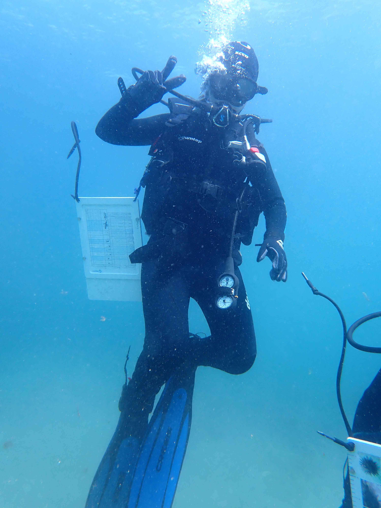

In August of 2025, I completed the American Academy of Underwater Sciences (AAUS) Scientific Diver certification through UCSB's Dive Safety Course. The certification required over 100 hours of training across 12 full days, covering everything from pool and ocean skill evaluations to written and online examinations. The course culminated in a three-day trip to USC's Wrigley Marine Institute on Catalina Island, where we dove in the open ocean and put everything we'd learned to the test. Earning this certification means I'm authorized to conduct SCUBA diving as part of scientific research. During the course I also completed my Rescue Diver Certification, my Nitrox Certification, and my Advanced Open Water Certification. 

::: {.lightbox layout="[[1, 1]]"}

