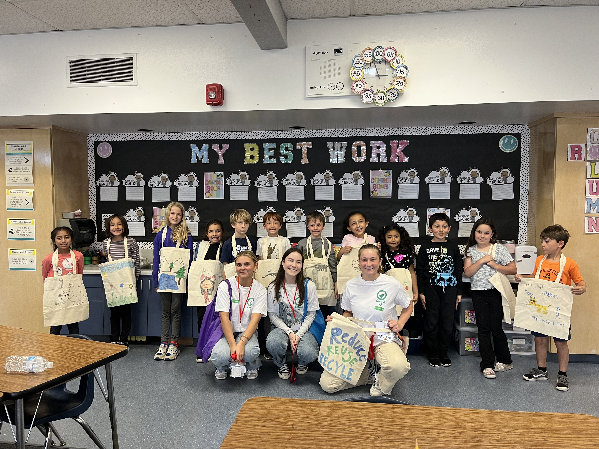
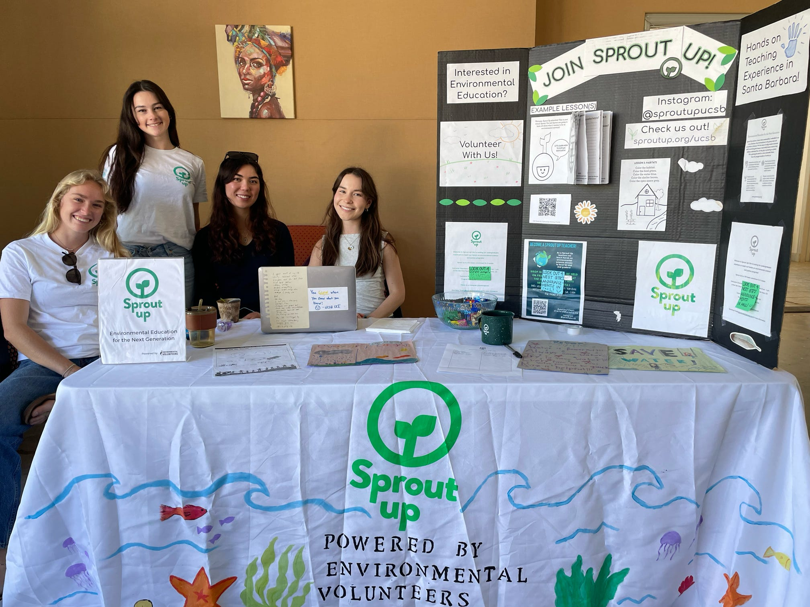
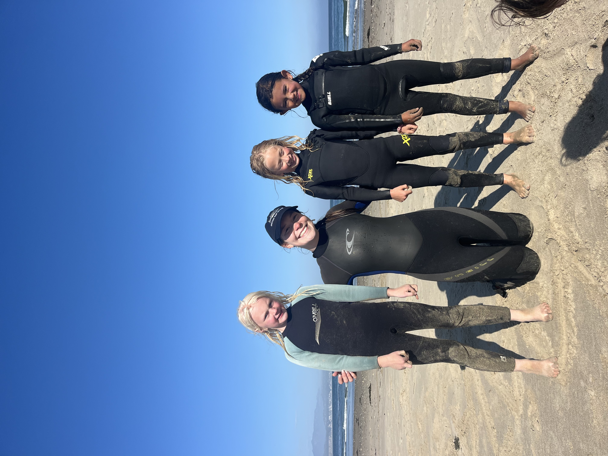

# Overview

<figure style="float: right; width: 250px; margin: 0 0 15px 20px;">
  
  <figcaption style="font-size: 0.85em; text-align: center;">Recruiting new volunteer instructors</figcaption>
</figure>

My [Sprout Up](https://www.sproutup.org/) journey started in Fall 2022 as an environmental science instructor in a second-grade classroom. Watching kids light up over water conservation, renewable energy, and strawberry DNA extraction made me realize just how much I love environmental education and science communication. I kept teaching every quarter, growing into a lead instructor role by Spring 2023, and stepping into my first leadership position as Development Manager by Fall 2023 — where I led grant applications that raised over $6,000 to help the program grow.

<figure style="float: right; width: 250px; margin: 0 0 15px 20px;">
  
  <figcaption style="font-size: 0.85em; text-align: center;">Collaborating with Sea League</figcaption>
</figure>

Now, as Director since Fall 2024, I oversee a team of 50+ volunteer instructors bringing weekly hands-on science lessons to Title I elementary schools across Santa Barbara. Beyond the classroom, Sprout Up hosts an annual 5K around the UCSB Lagoon Lawn, partners with organizations like [Sea League](https://www.thesealeague.org/) and the Isla Vista Community Services District, and runs quarterly fundraisers to keep our programming accessible and growing. What started as a weekly classroom visit has turned into one of the most meaningful parts of my undergraduate experience — and a constant reminder that every child deserves to see themselves as a scientist.


# Map of Sprout Up Santa Barbara Elementary Schools

Check out the map below to see all the elementary schools Sprout Up reaches!

<div style="text-align: center; margin-bottom: 2rem;">
```{r echo=FALSE, message=FALSE, warning=FALSE}

# installing packages
library(leaflet)
library(dplyr)

# School data
school_points <- data.frame(
  place = c(
    "Isla Vista Elementary",
    "Adams Elementary",
    "Ellwood School",
    "Peabody Elementary",
    "Hope Elementary",
    "El Camino School",
    "La Patera Elementary",
    "Foothill Elementary",
    "Franklin Elementary",
    "Brandon School",
    "Mountain View Elementary",
    "Washington Elementary",
    "Santa Barbara Charter",
    "Vieja Valley Elementary",
    "Kellogg Elementary",
    "Hollister Elementary"
  ),
  lat = c(
    34.417131,   # Isla Vista Elementary
    34.432373561934156,  # Adams Elementary
    34.430654812072945,  # Ellwood School
    34.441913502941674,  # Peabody Elementary
    34.4446362885025,   # Hope Elementary
    34.44029218966923,   # El Camino School
    34.447546265905224,  # La Patera Elementary
    34.450599207579536,  # Foothill Elementary
    34.425757339763074,   # Franklin Elementary
    34.43924149191082,   # Brandon School
    34.45534505619102,   # Mountain View Elementary
    34.39872595312704,   # Washington Elementary
    34.44960617291143,   # Santa Barbara Charter
    34.436441743553225,   # Vieja Valley Elementary
    34.44686676693862,   # Kellog Elementary
    34.43301150978495    # Hollister Elementary
  ),
  lon = c(
    -119.868633,  # Isla Vista Elementary
    -119.73423824922406,  # Adams Elementary
    -119.89662940136073,  # Ellwood School
    -119.7285846418421,  # Peabody Elementary
    -119.75414351802291,  # Hope Elementary
    -119.7973152148579,  # El Camino School
    -119.84731386189705,  # La Patera Elementary
    -119.80100441847958,  # Foothill Elementary
    -119.67826168837888,  # Franklin Elementary
    -119.89375757491162,  # Brandon School
    -119.8158848000435,  # Mountain View Elementary
    -119.72147211115615,  # Washington Elementary
    -119.83375747676304,  # Santa Barbara Charter
    -119.76953736141967,  # Vieja Valley Elementary
    -119.82123744607532,  # Kellogg Elementary
    -119.7945960037478   # Hollister Elementary
  ),
  grades = c(
    "1-2", "1-2", "1-2", "1-2",
    "1-2", "1, 2 & 4", "1-2", "1-2",
    "1-2", "1-2", "1-2", "1-2",
    "1-2", "1-2", "1-2", "1-2"
  )
)

# Create custom icons
ucsb_icon <- makeAwesomeIcon(
  icon = 'leaf', markerColor = 'green', iconColor = 'white', library = 'fa'
)

# Create custom icons
school_icon <- makeAwesomeIcon(
  icon = 'graduation-cap', markerColor = 'orange', iconColor = 'white', library = 'fa'
)

# Build the map
leaflet() %>%
  addProviderTiles(providers$OpenStreetMap) %>%
  # Add circle markers for all
  setView(lng = -119.80, lat = 34.43, zoom = 12) %>%
  addAwesomeMarkers(
    data = school_points,
    ~lon, ~lat,
    icon = ucsb_icon,
    popup = ~paste0(
      "<strong>", place, "</strong><br>",
      "Grades: ", grades
    )
  ) %>%
  # Add the grad cap icon for UCSB
  addAwesomeMarkers(
    lng = -119.8489, lat = 34.4140,
    icon = school_icon,
    popup = "<strong>UCSB — Sprout Up HQ</strong>"
  )
```
</div>

