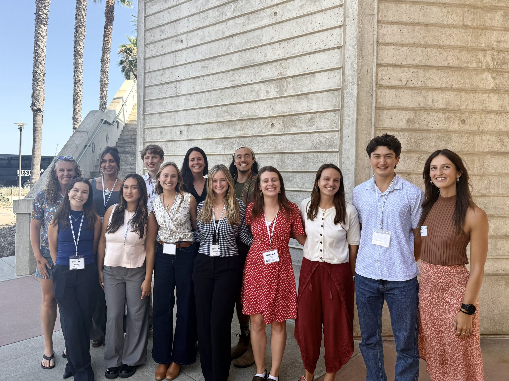

In the Summer of 2025, I was an Arnhold Environmental Fellow at UCSB's [Environmental Markets Lab (emLab)](https://emlab.ucsb.edu/), working alongside two graduate student mentors on a project combining fisheries science and ocean conservation.

Fisheries bycatch, the accidental capture of non-target species like sea turtles, whale sharks, and hammerhead sharks, is one of the most pressing challenges in marine management, threatening to push some species toward extinction while simultaneously causing economic hardships for fishing communities. Existing management strategies like marine protected areas and seasonal closures help, but they're rigid and slow to adapt to shifting species distributions and changing ocean conditions.

Our work aimed to change that. We set out to develop a decision-support tool that integrates joint dynamic species distribution models into dynamic ocean management frameworks, giving tuna fisheries managers near real-time guidance on where to fish in the Eastern Tropical Pacific Ocean to maximize target catch while minimizing bycatch. What makes this approach special is that rather than modeling one species at a time, joint dynamic species distribution models simultaneously analyze multiple species, accounting for their interactions, shared prey, and environmental drivers under current conditions and future climate scenarios.

My contribution centered on a deep literature review of the habitat associations, diets, and ecology of nine bycatch species, including leatherback sea turtles, whale sharks, giant manta rays, and multiple shark species, alongside target species like yellowfin, bigeye, and albacore tuna and swordfish. One of my key findings was that scalloped and smooth hammerhead sharks, silky sharks, and oceanic whitetip sharks all share prey (squid and octopus) with our target tuna species, suggesting they compete for similar resources in overlapping habitats. Understanding these ecological connections is what allows the model to make more accurate, nuanced predictions about where bycatch risk is highest.

The ultimate goal is a practical tool that helps fishers and managers transition toward more sustainable, adaptive, and economically viable fisheries while also anticipating how species distributions might shift under future climate change.

.pdf){width="95%" height="625"}
