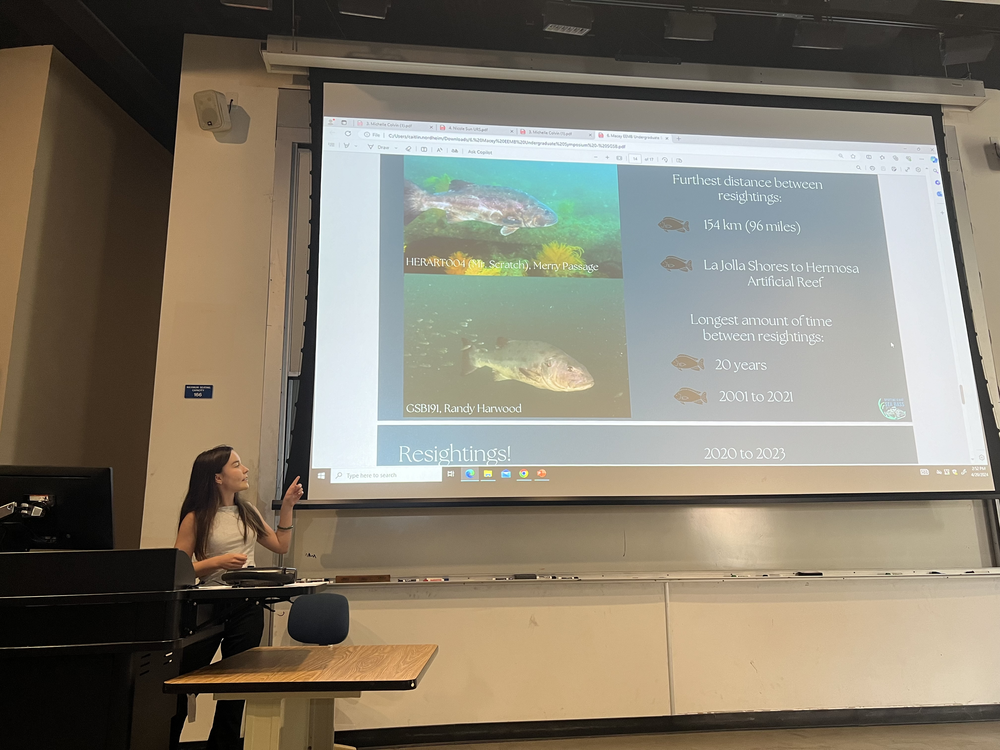

::: {style="text-align: center"}
{width=40%}
:::

I won the "Best Lightning Talk" award at UC Santa Barbara's 2024 [Ecology, Evolution, and Marine Biology's Undergraduate Research Symposium](https://undergrad-symposium.eemb.ucsb.edu/). I presented my 5-minute flash talk titled, "Uncovering the Mysteries of the Giant Sea Bass: Integrating Technology and Community Science for Conservation" to students, alumni, and the public, highlighting my research with the [Spotting Giant Sea Bass Project](https://spottinggiantseabass.msi.ucsb.edu/).

::: {style="text-align: center"}
{width=60%}
:::
