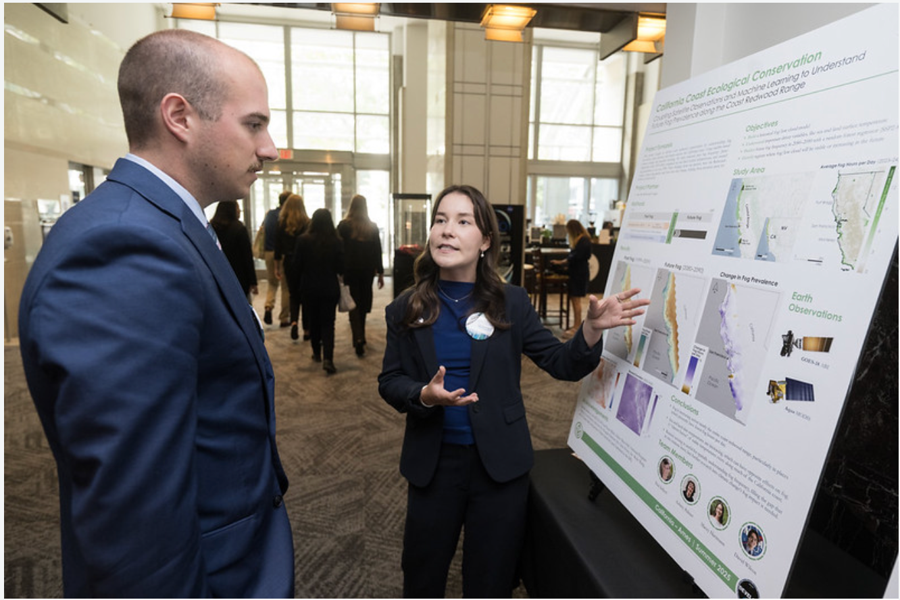

::: {style="text-align: center"}
{width=60%}
:::

Selected to represent our four-person NASA Ames Research Center team, I presented our California Coast Ecological Conservation poster at NASA Headquarters during the 2025 Earth Science DEVELOP Day. Our project used satellite remote sensing and machine learning to predict coastal fog patterns along the Northern California coast — research with direct implications for redwood forest conservation. Check out the poster below!

{width="95%" height="625"}