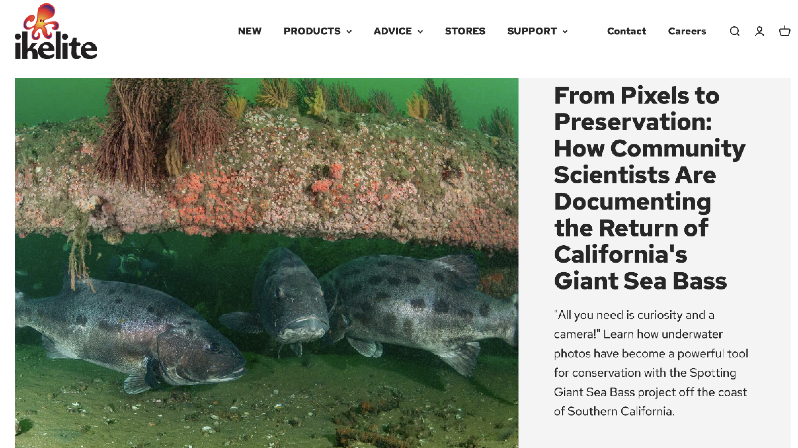

As Project Lead for the [Spotting Giant Sea Bass Project](https://spottinggiantseabass.msi.ucsb.edu/), I wrote a conservation feature for [Ikelite](https://www.ikelite.com/), a leading manufacturer in the underwater photographic industry. In this article, I shared how every photo taken of California's critically endangered giant sea bass contributes to groundbreaking conservation research, one "giant sea bass selfie" at a time. Dive into the full story [here](https://www.ikelite.com/blogs/features/from-pixels-to-preservation-how-community-scientists-are-documenting-the-return-of-californias-giant-sea-bass?srsltid=AfmBOorBwWTiarDwYA2ixfz0yKQhGVN5FzjUPQCAIRSYC3lat0gyUXUZ)!

